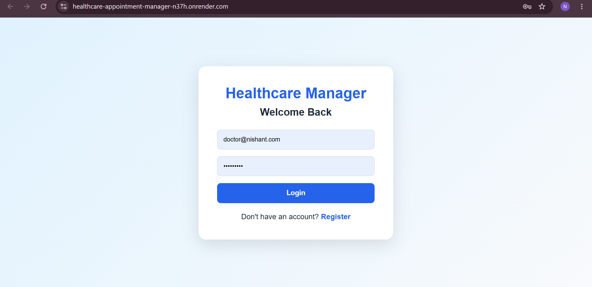
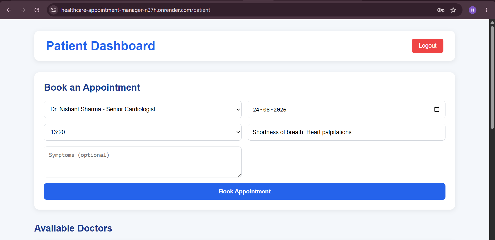
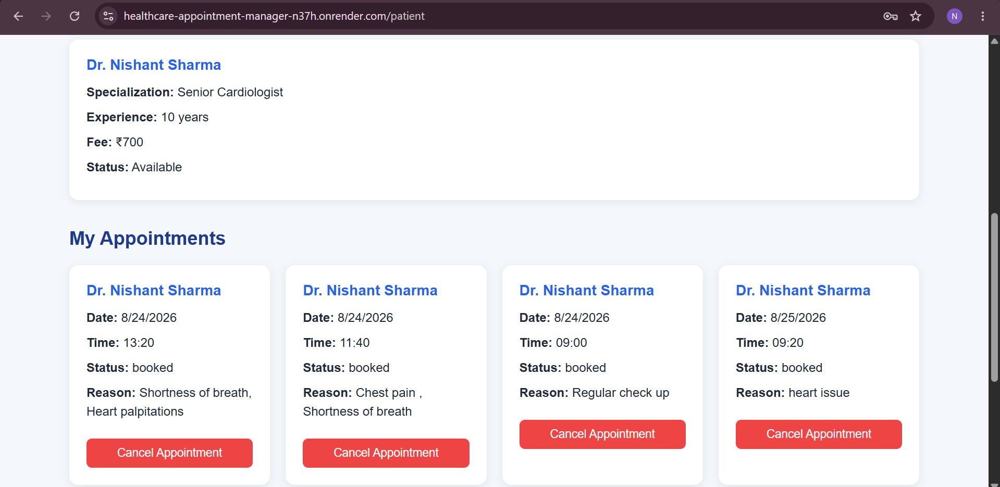
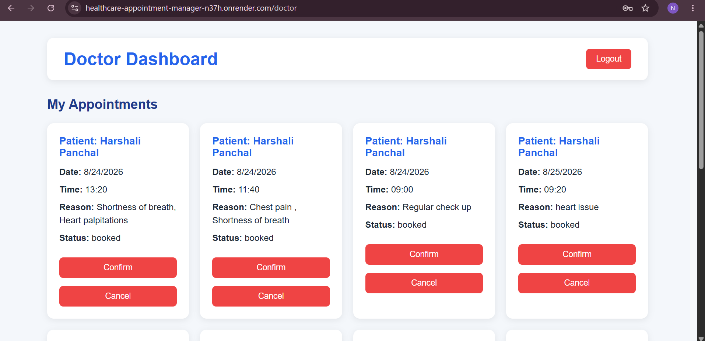
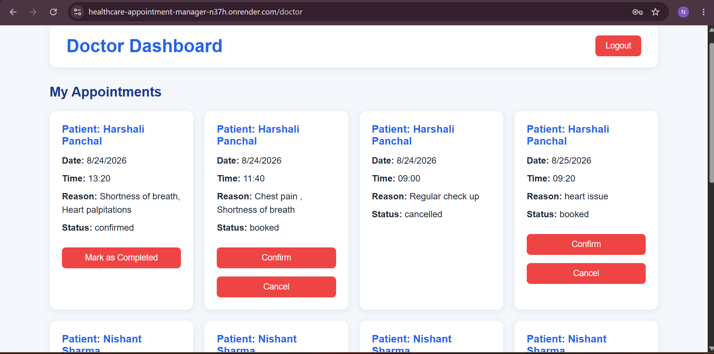
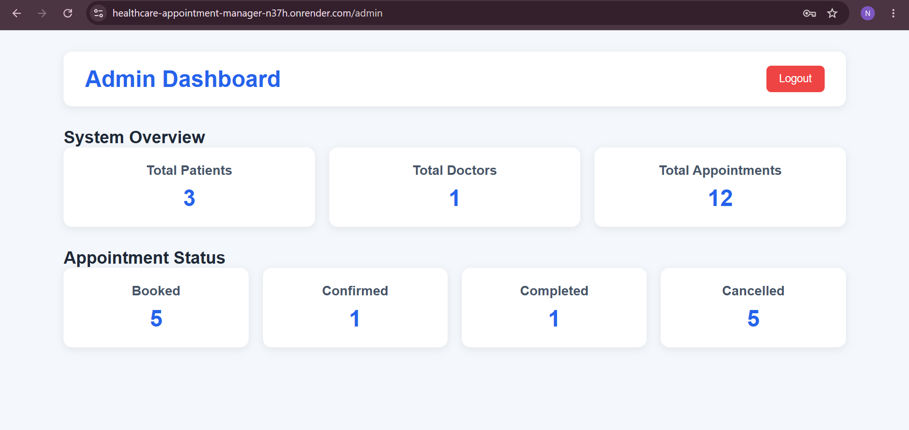

# Healthcare Appointment Manager

A full-stack web application designed to simplify and manage the healthcare appointment process. The system allows patients to book appointments, view appointment details, and cancel appointments, while doctors can manage their appointments and update appointment status.

## Live Demo

- **Frontend:** [healthcare-appointment-manager-n37h.onrender.com](https://healthcare-appointment-manager-n37h.onrender.com/)
- **Backend API:** [healthcare-appointment-manager-backend-0507.onrender.com](https://healthcare-appointment-manager-backend-0507.onrender.com/)

## Features

### Patient Features
- User registration and login
- JWT-based authentication
- View available doctors
- View doctor specialization, experience, consultation fee, and availability
- Book appointments
- View available appointment time slots
- View personal appointments
- Cancel booked or confirmed appointments

### Doctor Features
- Doctor authentication
- View assigned appointments
- View patient details
- View appointment reason and symptoms
- Confirm appointments
- Cancel appointments
- Mark confirmed appointments as completed

### Appointment Management
- Dynamic appointment slot generation
- Doctor working hours management
- Slot duration configuration
- Prevention of duplicate appointment booking
- Doctor leave date handling
- Appointment lifecycle management

## Appointment Workflow

The application supports the following appointment flow:

```text
Booked → Confirmed → Completed
       ↘
        Cancelled
```

## 📸 Application Screenshots

### 🔐 Login Page


The secure login interface allows registered users to access the Healthcare Appointment Management System based on their account credentials and role.

### 🏥 Patient Dashboard – Book an Appointment


Patients can select an available doctor, choose a date and time slot, provide the reason for the appointment, and optionally add symptoms before booking an appointment.

### 📅 Patient Dashboard – My Appointments


Patients can view their booked appointments, including doctor details, appointment date, time, reason, and current appointment status. Booked appointments can also be cancelled.

### 👨‍⚕️ Doctor Dashboard – Appointments


Doctors can view appointments booked by patients along with patient details, appointment date, time, reason, and appointment status.

### 🔄 Doctor Appointment Management


Doctors can manage appointment requests by confirming, cancelling, and marking confirmed appointments as completed.

### 👨‍💼 Admin Dashboard


The Admin Dashboard provides a system overview, including the total number of patients, doctors, appointments, and appointment status statistics such as booked, confirmed, completed, and cancelled.

### 🚀 Backend API


The deployed backend API is running successfully and provides the backend services required for authentication, appointment management, and dashboard functionality.

## Tech Stack

### Frontend
- React
- Vite
- React Router DOM
- Axios
- CSS

### Backend
- Node.js
- Express.js
- MongoDB
- Mongoose
- JSON Web Token (JWT)
- bcryptjs

## Project Structure

```
healthcare-appointment-manager/
│
├── frontend/
│   ├── src/
│   │   ├── pages/
│   │   │   ├── Login.jsx
│   │   │   ├── Register.jsx
│   │   │   ├── PatientDashboard.jsx
│   │   │   └── DoctorDashboard.jsx
│   │   ├── App.jsx
│   │   └── main.jsx
│   └── package.json
│
├── backend/
│   ├── config/
│   ├── controllers/
│   ├── middleware/
│   ├── models/
│   ├── routes/
│   ├── server.js
│   └── package.json
│
├── screenshots/
│   ├── login-page.png
│   ├── patient-dashboard-booking.png
│   ├── patient-appointments.png
│   ├── doctor-dashboard-booked.png
│   ├── doctor-appointment-management.png
│   ├── admin-dashboard.png
│   └── backend-api-running.png
│
└── README.md
```

## API Features

### Authentication
- Register a new user
- Login with JWT authentication
- Role-based authorization

### Doctors
- Create doctor profile
- View all doctors
- Update doctor details
- Manage doctor availability
- Add leave dates
- Generate available appointment slots

### Appointments
- Book appointment
- View patient appointments
- View doctor appointments
- Update appointment status
- Cancel appointment
- Prevent duplicate slot booking

## Installation

### Clone the repository

```bash
git clone https://github.com/ns4390037-debug/healthcare-appointment-manager.git
```

### Backend Setup

```bash
cd backend
npm install
```

Create a `.env` file:

```
MONGO_URI=your_mongodb_connection_string
PORT=5000
JWT_SECRET=your_jwt_secret
```

Start the backend:

```bash
npm run dev
```

### Frontend Setup

Open another terminal:

```bash
cd frontend
npm install
npm run dev
```

The frontend will run locally on:

```
http://localhost:5173
```

The backend will run locally on:

```
http://localhost:5000
```

## Environment Variables

Create a `.env` file inside the backend folder:

```
MONGO_URI=your_mongodb_connection_string
PORT=5000
JWT_SECRET=your_jwt_secret
```

## Future Improvements
- Admin dashboard
- Online payment integration
- Email appointment notifications
- Patient profile management
- Doctor profile image
- Appointment reminders
- Medical history management
- Search and filter doctors

## Author
**Nishant Sharma**
- GitHub: [ns4390037-debug](https://github.com/ns4390037-debug)
- Email: ns4390037@gmail.com