# 🏥 Healthcare Appointment & Follow-up Manager

A full-stack healthcare appointment and follow-up management platform with separate portals for **Patients**, **Doctors**, and **Admins**. The system lets patients book appointments and share symptoms in advance, generates an AI-powered pre-visit summary for doctors, produces a patient-friendly post-visit summary, and keeps both sides informed through email and Google Calendar.

## 🌐 Live Demo

- **Frontend:** [healthcare-appointment-manager-n37h.onrender.com](https://healthcare-appointment-manager-n37h.onrender.com/)
- **Backend API:** [healthcare-appointment-manager-backend-0507.onrender.com](https://healthcare-appointment-manager-backend-0507.onrender.com/)

## 🎯 Objective

A clinic needs more than a basic booking form. Patients want to share symptoms in advance and get reminders, doctors want a quick summary before each visit, and both sides expect timely confirmations by email and calendar. This platform delivers exactly that — appointment booking, AI-generated pre-visit and post-visit summaries, medication reminders, and automated email + Google Calendar sync, built on role-based access for Patient, Doctor, and Admin.

## ✨ Key Features

### 👤 Patient Portal
- Register, log in (JWT-based auth), and manage profile
- Search doctors by specialisation, experience, and availability
- Book an available slot with double-booking prevention
- Fill a pre-visit symptom form before confirming the booking
- View AI-generated pre-visit summary (urgency level, chief complaint, suggested questions)
- Receive booking confirmation, reminder, and cancellation emails
- Auto-synced Google Calendar event on booking, reschedule, and cancellation
- Receive medication reminders based on prescription frequency
- View patient-friendly AI post-visit summary after consultation
- Cancel booked/confirmed appointments

### 🩺 Doctor Portal
- Doctor login and profile management
- View assigned appointments with the patient's pre-visit AI summary
- Confirm or cancel appointment requests
- Mark leave dates — system flags and notifies affected patients automatically
- Submit post-visit consultation notes and prescription
- LLM converts notes into a patient-friendly post-visit summary + medication schedule
- Mark confirmed appointments as completed

### 🛠️ Admin Portal
- Create and manage doctor profiles (specialisation, working hours, slot duration, leave days)
- System-wide dashboard: total patients, doctors, appointments
- Appointment status statistics: booked, confirmed, completed, cancelled

### 🤖 AI-Powered Features
- **Pre-visit summary:** urgency level (Low/Medium/High), chief complaint, 3 suggested questions for the doctor
- **Post-visit summary:** patient-friendly explanation of clinical notes, medication schedule, follow-up steps
- Graceful degradation — if the LLM call fails, the appointment still proceeds and a retry/fallback message is shown instead of blocking the flow

### 🔔 Notifications & Integrations
- Email (booking confirmation, reminder, cancellation, doctor-leave notice) via Nodemailer
- Google Calendar event creation, update, and deletion via Calendar API + OAuth 2.0
- Background job for medication reminders and failed-email retries

## 🔄 Application Workflow

**Appointment Status Flow**
```text
Booked → Confirmed → Completed
       ↘
        Cancelled
```

**Patient Flow**
```
Register/Login → Search Doctor → Select Slot → Fill Symptom Form → AI Pre-Visit Summary Generated
→ Confirm Booking → Email + Google Calendar Event Created → Reminder Sent
→ Post-Visit: AI Summary + Medication Schedule Delivered
```

**Doctor Flow**
```
Login → View Appointments (with AI Pre-Visit Summary) → Confirm/Cancel
→ Conduct Consultation → Submit Notes & Prescription → AI Post-Visit Summary Generated → Mark Completed
```

**Admin Flow**
```
Login → Create/Manage Doctor Profiles (specialisation, hours, slot duration, leave)
→ Monitor Dashboard → View Appointment Statistics
```

## 📸 Application Screenshots

Screenshots are stored inside the `screenshots/` folder.

### 🔐 Login Page
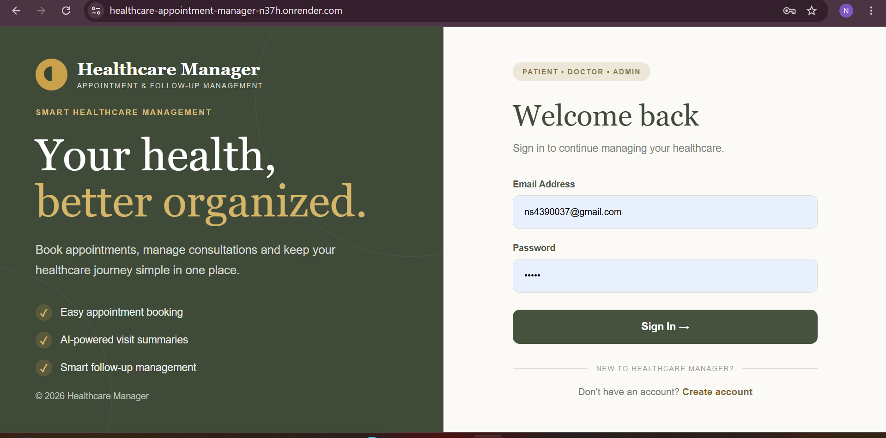

Secure role-based login for patients, doctors, and admins.

### 📝 Registration Page
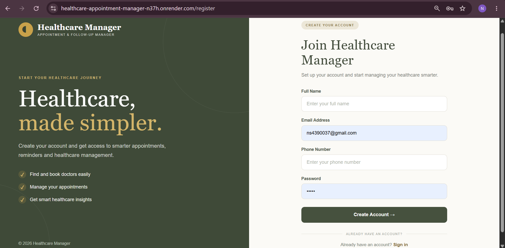

New patients can register with their basic details.

### 🏥 Patient Dashboard
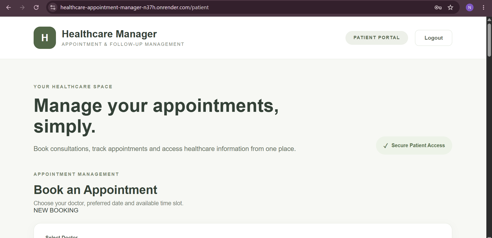

Patients can search and view available doctors by specialisation, experience, fee, and availability.

### 📅 Book Appointment
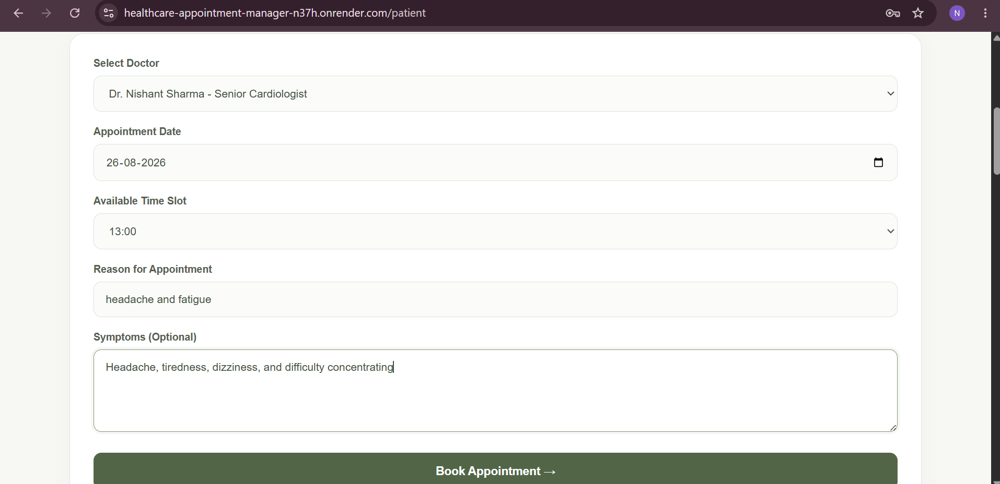

Patients select a slot and fill in the pre-visit symptom form before confirming the booking.

### 🤖 AI Appointment Booking Summary
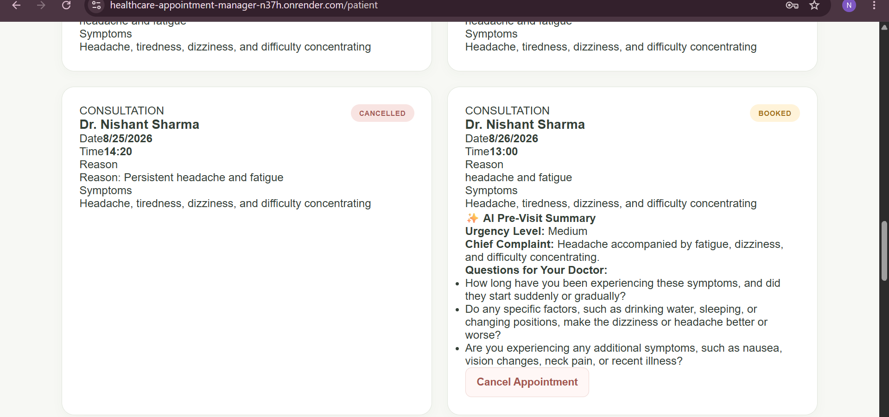

An AI-generated pre-visit summary — urgency level, chief complaint, and suggested questions — is shown to the doctor at booking time.

### 👨‍⚕️ Doctor Dashboard
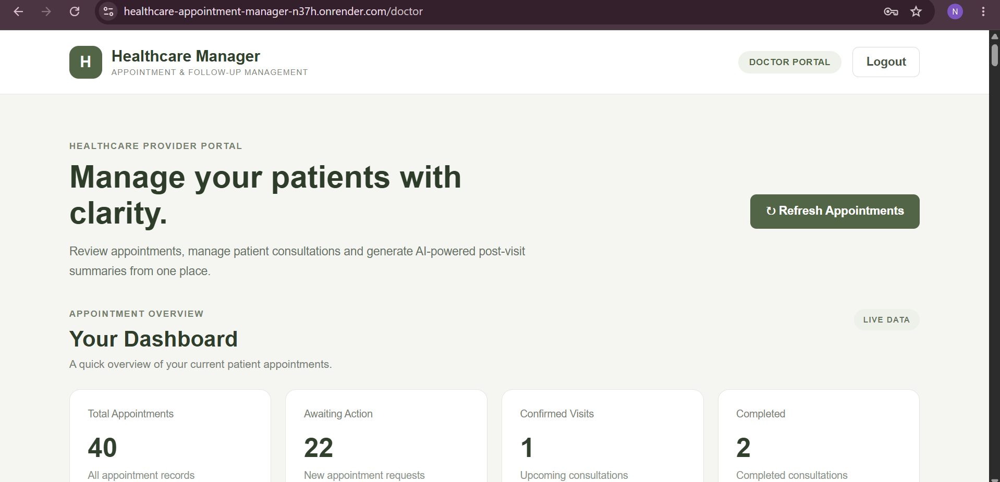

Doctors can view their appointment list with patient and appointment details.

### 🔄 Doctor Appointment Management
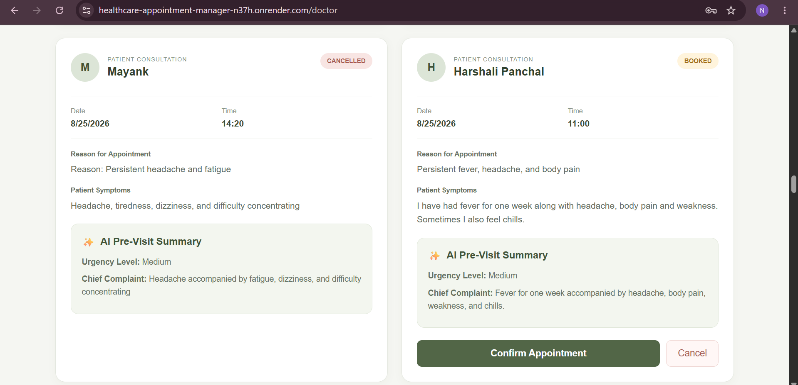

Doctors can confirm, cancel, or mark appointments as completed.

### 🩺 Consultation Details
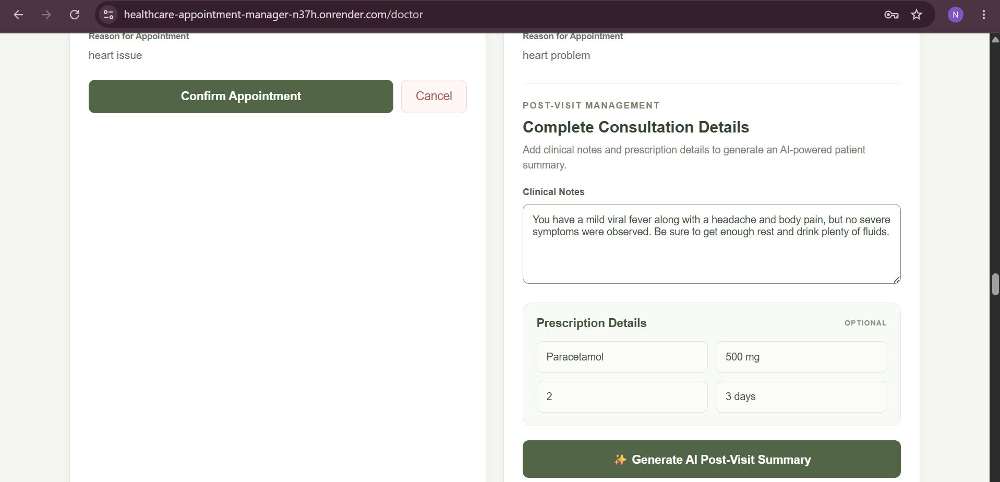

Doctors add clinical consultation notes and prescription details after the visit.

### 🤖 AI Post-Visit Summary
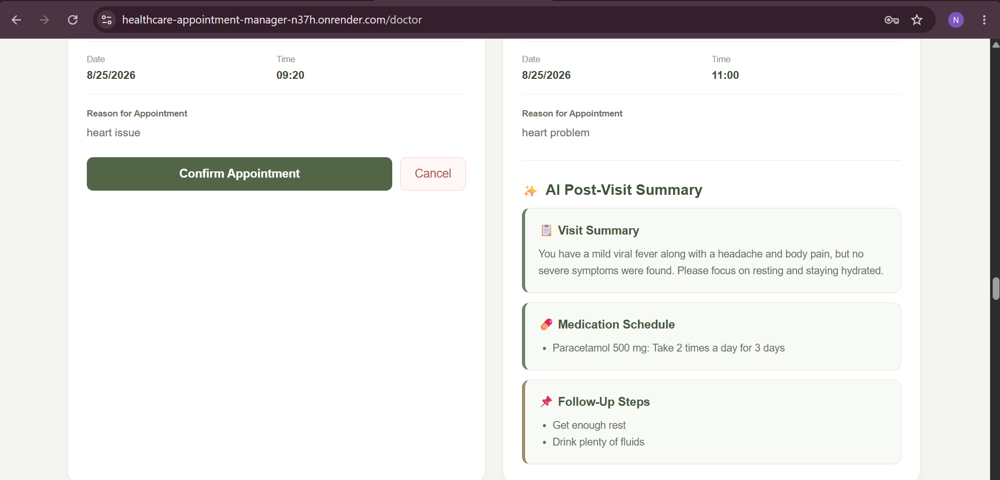

The LLM converts clinical notes into a patient-friendly summary with medication schedule and follow-up steps.

### 👨‍💼 Admin Dashboard
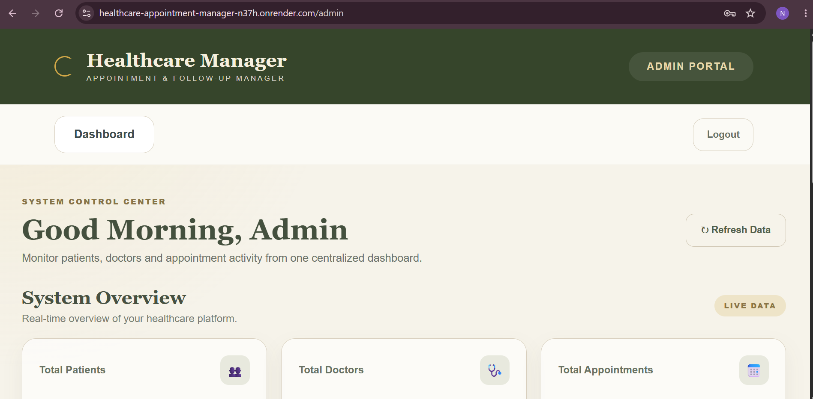

System overview showing total patients, doctors, and appointments.

### 📊 Admin System Overview
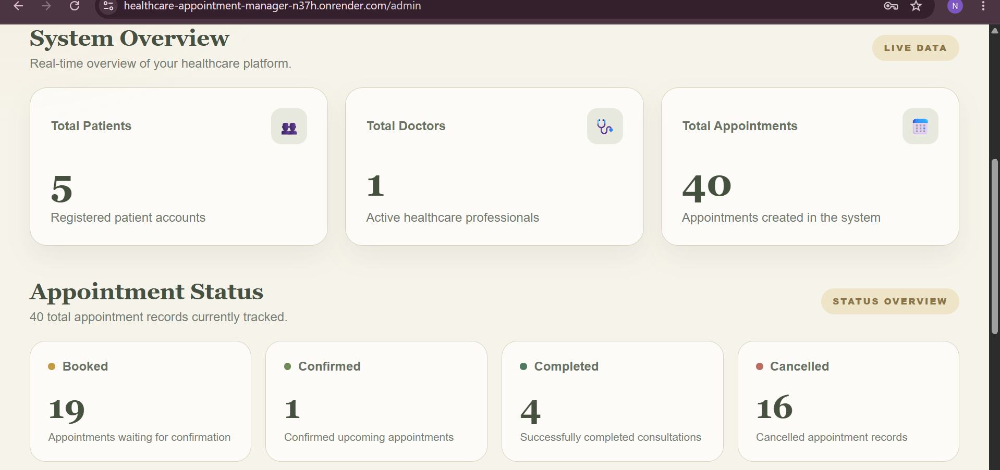

Detailed appointment status statistics — booked, confirmed, completed, and cancelled.

### 📧 Email Appointment Confirmation
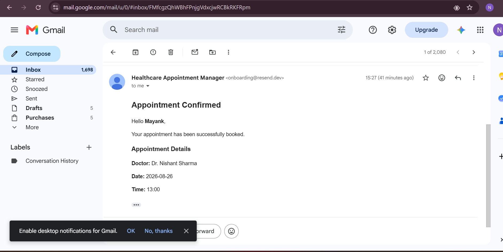

Patients and doctors receive email confirmations, reminders, and cancellation notices.

### 📆 Google Calendar Integration
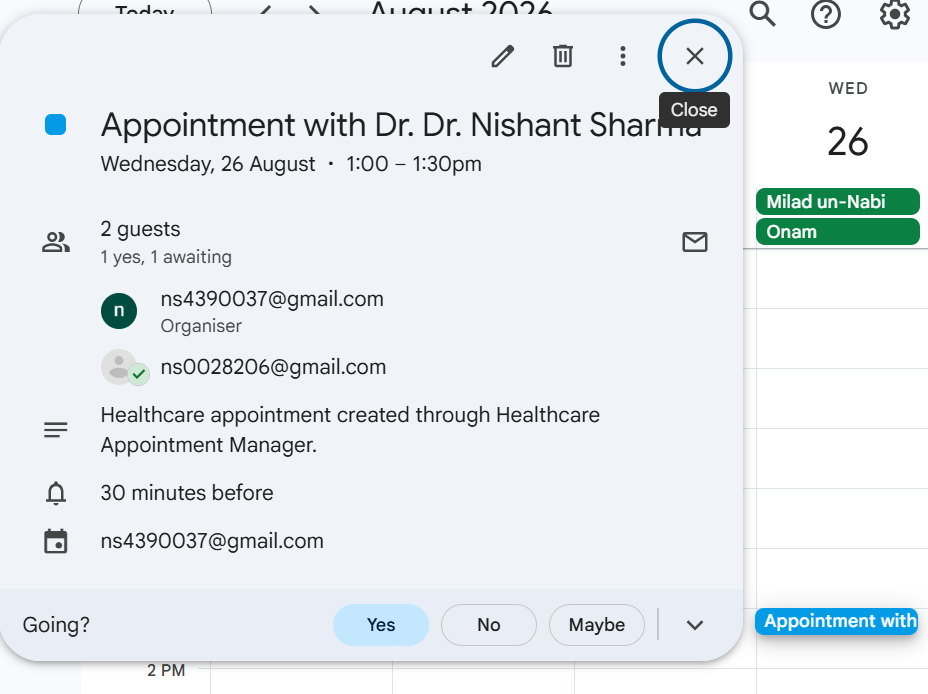

Booked appointments are synced to Google Calendar and updated on reschedule or cancellation.

### 🚀 Backend API
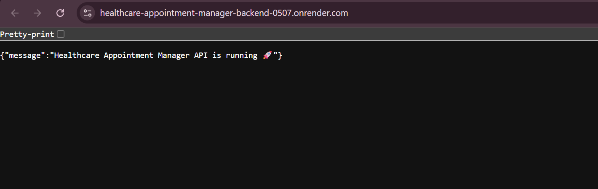

The deployed backend API running successfully on Render.

## 🛠️ Tech Stack

**Frontend:** React, Vite, React Router DOM, Axios, CSS
**Backend:** Node.js, Express.js
**Database:** MongoDB, Mongoose
**Auth:** JSON Web Token (JWT), bcryptjs
**AI:** LLM API (pre-visit & post-visit summary generation)
**Email:** Nodemailer (SendGrid/Mailgun-compatible)
**Calendar:** Google Calendar API with OAuth 2.0
**Background Jobs:** node-cron (medication reminders, email retry queue)
**Deployment:** Render

## 📂 Project Structure

```
healthcare-appointment-manager/
│
├── frontend/
│   ├── src/
│   │   ├── pages/
│   │   │   ├── Login.jsx
│   │   │   ├── Register.jsx
│   │   │   ├── PatientDashboard.jsx
│   │   │   ├── DoctorDashboard.jsx
│   │   │   └── AdminDashboard.jsx
│   │   ├── App.jsx
│   │   └── main.jsx
│   └── package.json
│
├── backend/
│   ├── config/          # DB connection, Google OAuth, mailer config
│   ├── controllers/      # Route logic (auth, doctors, appointments, admin)
│   ├── middleware/       # JWT auth, role guard, error handler
│   ├── models/           # Mongoose schemas
│   ├── routes/           # Express routers
│   ├── services/         # LLM service, email service, calendar service
│   ├── jobs/              # Cron jobs — reminders, email retry
│   ├── server.js
│   └── package.json
│
├── screenshots/
│   ├── 01_login_page.png ... backend-api-running.png
│
├── package.json
├── package-lock.json
└── README.md
```

## 🗄️ Database Schema (MongoDB / Mongoose)

**User** — `name, email, passwordHash, role [patient|doctor|admin], phone, createdAt`

**DoctorProfile** — `userId (ref User), specialisation, experienceYears, consultationFee, workingHours {start, end}, slotDurationMins, leaveDates [Date], createdAt`

**Appointment** — `patientId (ref User), doctorId (ref User), date, slotStart, slotEnd, status [booked|confirmed|completed|cancelled], symptomForm {text, submittedAt}, preVisitSummary {urgency, chiefComplaint, suggestedQuestions[]}, consultationNotes, prescription [{medicine, dosage, frequency, durationDays}], postVisitSummary {text, medicationSchedule[], followUp}, calendarEventId, createdAt, updatedAt`

**SlotHold** — `doctorId, date, slotStart, patientId, expiresAt` (TTL index — used to reserve a slot for a short window while booking is confirmed, preventing race conditions)

**NotificationLog** — `type [email|calendar], appointmentId, status [pending|sent|failed], retryCount, lastAttemptAt`

## 🔌 API Documentation (summary)

| Method | Endpoint | Access | Description |
|--------|-----------|--------|--------------|
| POST | `/api/auth/register` | Public | Register patient/doctor |
| POST | `/api/auth/login` | Public | Login, returns JWT |
| GET | `/api/doctors` | Auth | List/search doctors by specialisation |
| POST | `/api/admin/doctors` | Admin | Create doctor profile |
| PUT | `/api/admin/doctors/:id` | Admin | Update hours, slot duration, leave days |
| GET | `/api/doctors/:id/slots?date=` | Auth | Get available slots for a date |
| POST | `/api/appointments/hold` | Patient | Temporarily hold a slot (SlotHold, TTL) |
| POST | `/api/appointments` | Patient | Confirm booking + symptom form → triggers AI pre-visit summary, email, calendar event |
| GET | `/api/appointments/mine` | Patient/Doctor | List own appointments |
| PATCH | `/api/appointments/:id/status` | Doctor | Confirm / cancel / complete |
| POST | `/api/appointments/:id/consultation` | Doctor | Submit notes + prescription → triggers AI post-visit summary |
| DELETE | `/api/appointments/:id` | Patient/Doctor | Cancel → removes calendar event, sends email |
| GET | `/api/admin/stats` | Admin | Dashboard statistics |

## 🤖 LLM Prompts Used

**Pre-visit summary**
```
Analyse these symptoms and return: urgency level (Low / Medium / High),
chief complaint, and three suggested questions for the doctor.
Symptoms: {symptomText}
```

**Post-visit summary**
```
Convert these clinical notes into a patient-friendly summary with
medication schedule and follow-up steps: {consultationNotes}
```

Both prompts request structured JSON output which is validated before saving to `Appointment.preVisitSummary` / `Appointment.postVisitSummary`. If parsing or the API call fails, the service falls back to a plain-text placeholder and logs the error — the booking/consultation flow is never blocked by an LLM failure.

## 📆 Google Calendar Setup (OAuth 2.0)

1. Create a project in [Google Cloud Console](https://console.cloud.google.com/) and enable the **Google Calendar API**.
2. Configure the OAuth consent screen and create OAuth 2.0 credentials (Web application).
3. Add the authorized redirect URI, e.g. `http://localhost:5000/api/auth/google/callback` (and the Render backend URL for production).
4. Copy the generated **Client ID** and **Client Secret** into the backend `.env`.
5. On first login, patients/doctors are redirected to Google's consent screen; the returned refresh token is stored against their profile and used by the backend to create/update/delete calendar events on booking, reschedule, or cancellation.

## ⚙️ Installation

```bash
git clone https://github.com/ns4390037-debug/healthcare-appointment-manager.git
```

**Backend**
```bash
cd backend
npm install
npm run dev
```

**Frontend** (in a separate terminal)
```bash
cd frontend
npm install
npm run dev
```

- Frontend (local): `http://localhost:5173`
- Backend (local): `http://localhost:5000`

## 🔑 Environment Variables (`.env.example`)

```env
# Server
PORT=5000

# Database
MONGO_URI=your_mongodb_connection_string

# Auth
JWT_SECRET=your_jwt_secret

# LLM
LLM_API_KEY=your_llm_provider_api_key
LLM_MODEL=your_model_name

# Email (Nodemailer)
EMAIL_HOST=smtp.your-provider.com
EMAIL_PORT=587
EMAIL_USER=your_email_user
EMAIL_PASS=your_email_password_or_api_key

# Google Calendar OAuth
GOOGLE_CLIENT_ID=your_google_client_id
GOOGLE_CLIENT_SECRET=your_google_client_secret
GOOGLE_REDIRECT_URI=http://localhost:5000/api/auth/google/callback
```

## 🧠 System Design Write-Up

**Double-booking prevention.** Every slot is defined by `(doctorId, date, slotStart)`, backed by a unique compound index in MongoDB. When a patient selects a slot, the backend first writes a `SlotHold` document with a short TTL (e.g. 3–5 minutes) instead of writing directly to `Appointment`. The hold acts as a temporary lock — a second patient attempting the same slot is rejected at the hold stage because the unique index rejects the duplicate `(doctorId, date, slotStart)` combination. If the patient completes the symptom form and confirms within the TTL window, the hold is atomically converted into a confirmed `Appointment` inside a MongoDB transaction; if the TTL expires, MongoDB's TTL index automatically deletes the hold and the slot becomes available again. This avoids double-booking under concurrent requests without needing an external lock service.

**Simultaneous booking attempts.** Because the hold-creation step relies on the database's own uniqueness constraint (not application-level checks), two simultaneous requests for the same slot resolve deterministically — one write succeeds, the other fails fast with a "slot no longer available" response, and the frontend re-fetches the updated slot list.

**Doctor leave conflict handling.** When an admin or doctor marks a leave date, the backend queries all `Appointment` documents for that doctor on that date with status `booked` or `confirmed`. Each affected appointment is marked `cancelled` with a `cancelledReason: "doctor_leave"`, a `NotificationLog` entry is queued for both email and calendar-deletion, and the patient is notified via email with a prompt to rebook. This is done in a single batch job rather than synchronously, so marking leave for a doctor with many existing bookings doesn't block the admin's request.

**Slot hold mechanism.** The `SlotHold` collection (with a MongoDB TTL index on `expiresAt`) exists specifically to bridge the gap between "patient picked a slot" and "patient finished the symptom form and confirmed." Without this, two patients could both see the same open slot and both submit a booking. The hold reserves the slot the moment it's selected, and releases it automatically (via TTL expiry) if the patient abandons the flow — no manual cleanup job needed.

**Notification failure handling.** Every outbound email and calendar sync is recorded in `NotificationLog` with a `status` and `retryCount`. If an email send or calendar API call fails (timeout, provider error, expired OAuth token), the log entry is marked `failed` rather than throwing an error back to the user — the appointment booking itself still succeeds. A background cron job periodically scans for `failed` entries with `retryCount` under a max threshold and retries them with exponential backoff. This decouples the user-facing booking flow from third-party service reliability, so a temporary email/calendar outage never blocks a patient from booking or a doctor from completing a consultation.

## 🌟 Project Highlights
- Multi-role architecture (Patient, Doctor, Admin) with JWT-based auth
- Race-condition-safe slot booking via TTL-backed slot holds
- LLM-powered pre-visit and post-visit summaries with graceful failure handling
- Automated email + Google Calendar sync with retry-based notification reliability
- Doctor leave conflict detection with automatic patient notification

## 🚀 Future Improvements
- Online payment integration
- Doctor profile image upload
- In-app chat between patient and doctor
- Multi-language support for AI summaries

## ⚠️ Disclaimer
This project is developed for educational and demonstration purposes. AI-generated healthcare summaries are supportive features and should not be considered a replacement for professional medical diagnosis or treatment.

## 👩‍💻 Author
**Nishant Sharma**
- GitHub: [ns4390037-debug](https://github.com/ns4390037-debug)
- Email: ns4390037@gmail.com

## ⭐ Support
If you found this project interesting, consider giving the repository a star!